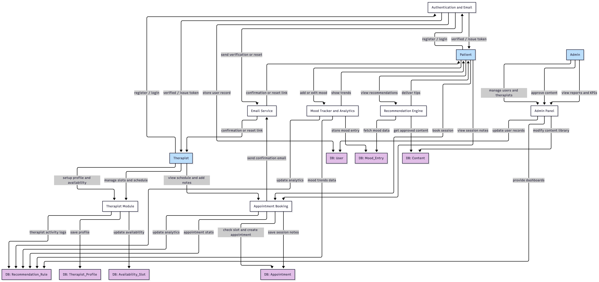
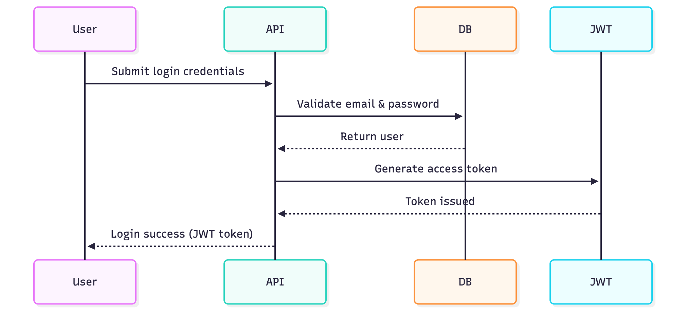
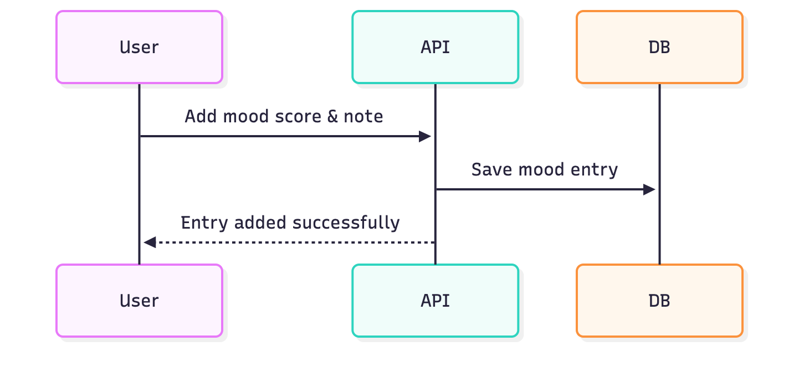

# System Data Flow

## Understanding How MindEase Works Behind the Scenes

This section provides a visual overview of how information moves through the **MindEase** platform —  
from user actions on the frontend (PWA) to backend processing in Django, database interactions, and supporting services like email, recommendations, and analytics.

Below is the **overall data flow diagram**, followed by detailed module-level flows explaining each major feature in the system.

---

# Data Flow Diagrams

This section visually explains how data moves across different modules in the MindEase system.  
Each diagram below represents the end-to-end flow between the user interface, backend APIs, and database.

---

## Authentication & Email Verification

**Flow Summary:** Handles user registration, email verification, and account activation.

---

## User Login (JWT)

**Flow Summary:** Users log in using email and password to receive secure JWT tokens for session management.

---

## Mood Tracker

**Flow Summary:** Users log their daily mood, and data is stored and analyzed for weekly trends.

---

## Recommendation Engine

**Flow Summary:** Suggests mindfulness content based on user’s recent mood patterns.

.png)

---

## Therapist Module

**Flow Summary:** Therapists set up profiles and availability; admins approve profiles before listing.

---

## Appointment Booking

**Flow Summary:** Patients book available therapy sessions; confirmation emails are sent automatically.

---

## Admin Panel

**Flow Summary:** Admin manages users, content, therapists, and views platform-wide analytics.

---

## Password Reset

**Flow Summary:** Users reset passwords via email token validation.

---

