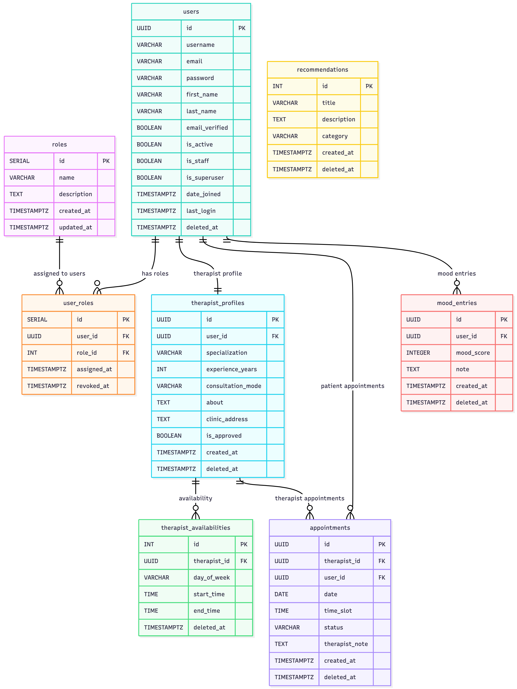

# Database Schema Documentation

This document describes the complete database schema for the **MindEase - Mood Tracking & Therapy Booking System**, including all tables, fields, relationships, indexes, and key constraints.

---

## 1. Tables and Fields

### 1.1 roles

| Field       | Type       | Description                                |
|-------------|------------|--------------------------------------------|
| id          | SERIAL PK  | Auto-increment role ID                     |
| name        | VARCHAR    | Role name (`admin`, `therapist`, `patient`)|
| description | TEXT       | Short description of the role              |
| created_at  | TIMESTAMPTZ| Timestamp of creation                      |
| updated_at  | TIMESTAMPTZ| Last updated timestamp                     |

**Indexes:**  
- `ux_roles_name` UNIQUE(name) - ensures each role name is unique.

---

### 1.2 user_roles

| Field       | Type       | Description                                  |
|-------------|------------|----------------------------------------------|
| id          | SERIAL PK  | Auto-increment mapping ID                    |
| user_id     | INT FK     | References `users.id` (user assigned the role) |
| role_id     | INT FK     | References `roles.id` (assigned role)        |
| assigned_at | TIMESTAMPTZ| When the role was assigned                    |
| revoked_at  | TIMESTAMPTZ| When the role was revoked (optional)          |

**Indexes:**  
- `ux_user_roles_user_role` UNIQUE(user_id, role_id, assigned_at) - prevent duplicate immediate assignments (optional depending on policy).  
- `ix_user_roles_user` on `(user_id)` - fast lookup of a user’s roles.  
- `ix_user_roles_role` on `(role_id)` - fast lookup of users by role.

> **Note:** `user_roles` is a bridge table enabling flexible role assignment (one user may hold multiple roles over time if desired). If your policy allows only one active role per user, make `user_roles` constrained accordingly (e.g., by checking active periods or adding a uniqueness constraint on user_id with `revoked_at IS NULL`).

---

### 1.3 users

| Field       | Type        | Description |
|-------------|-------------|-------------|
| id          | SERIAL PK   | Auto-increment user ID |
| username    | VARCHAR     | Display username |
| email       | VARCHAR     | User’s email address |
| password_hash | VARCHAR   | Hashed password |
| first_name  | VARCHAR     | First name |
| last_name   | VARCHAR     | Last name |
| email_verified | BOOLEAN  | Whether email is verified |
| created_at  | TIMESTAMPTZ | Account creation timestamp |
| updated_at  | TIMESTAMPTZ | Last update timestamp |
| deleted_at  | TIMESTAMPTZ | Soft delete timestamp |

**Indexes:**  
- `ux_users_email_lower` on `lower(email)` - case-insensitive uniqueness lookup (enforce unique index in DB if desired).  
- `ix_users_created_at` on `(created_at)` - for administrative queries sorted by signup date.

---

### 1.4 therapist_profiles

| Field            | Type         | Description |
|------------------|--------------|-------------|
| id               | SERIAL PK    | Therapist profile ID |
| user_id          | INT FK       | Linked user account (`users.id`) |
| specialization   | VARCHAR      | Therapist’s specialty |
| experience_years | SMALLINT     | Years of experience |
| consultation_mode| VARCHAR      | `online`, `in-person`, or `both` |
| about            | TEXT         | Bio or description |
| clinic_address   | TEXT         | Clinic location (if applicable) |
| is_approved      | BOOLEAN      | Admin approval status |
| created_at       | TIMESTAMPTZ  | Created timestamp |
| updated_at       | TIMESTAMPTZ  | Updated timestamp |
| deleted_at       | TIMESTAMPTZ  | Soft delete timestamp |

**Indexes:**  
- `ux_therapist_user` UNIQUE(user_id) - one profile per user.  
- `ix_therapist_specialization_approved` on `(specialization, is_approved)` - fast filtering for approved therapists.

---

### 1.5 availability_slots

| Field       | Type         | Description |
|-------------|--------------|-------------|
| id          | SERIAL PK    | Slot ID |
| therapist_id| INT FK       | References `therapist_profiles.id` |
| day_of_week | SMALLINT     | Day (0–6: Sun–Sat) |
| start_time  | TIME         | Slot start time |
| end_time    | TIME         | Slot end time |
| status      | VARCHAR      | `available` or `booked` |
| created_at  | TIMESTAMPTZ  | Created timestamp |
| updated_at  | TIMESTAMPTZ  | Updated timestamp |
| deleted_at  | TIMESTAMPTZ  | Soft delete timestamp |

**Indexes:**  
- `ix_slots_therapist_day_time` on `(therapist_id, day_of_week, start_time)` - efficient retrieval of slots for a therapist/day.

---

### 1.6 appointments

| Field            | Type         | Description |
|------------------|--------------|-------------|
| id               | SERIAL PK    | Appointment ID |
| therapist_id     | INT FK       | References `therapist_profiles.id` |
| user_id          | INT FK       | References `users.id` (patient) |
| slot_id          | INT FK       | References `availability_slots.id` |
| appointment_date | DATE         | Appointment date |
| time_slot        | TIME         | Time of session |
| status           | VARCHAR      | `pending`, `confirmed`, `cancelled`, `completed` |
| therapist_note   | TEXT         | Therapist notes (visible to patient after session) |
| created_at       | TIMESTAMPTZ  | Created timestamp |
| updated_at       | TIMESTAMPTZ  | Updated timestamp |
| deleted_at       | TIMESTAMPTZ  | Soft delete timestamp |

**Indexes:**  
- `ux_appt_unique` UNIQUE(therapist_id, appointment_date, time_slot) - prevents double-booking of same therapist slot.  
- `ix_appt_user_recent` on `(user_id, appointment_date DESC)` - fast retrieval of recent user appointments.

---

### 1.7 mood_entries

| Field       | Type         | Description |
|-------------|--------------|-------------|
| id          | SERIAL PK    | Mood entry ID |
| user_id     | BIGINT FK    | References `users.id` |
| mood_score  | SMALLINT     | Mood rating (1–5) |
| note        | TEXT         | Optional note |
| created_at  | DATE         | Date of entry (one per day) |
| updated_at  | TIMESTAMPTZ  | Updated timestamp |
| deleted_at  | TIMESTAMPTZ  | Soft delete timestamp |

**Indexes:**  
- `ux_mood_user_date` UNIQUE(user_id, created_at) - enforces one mood entry per user per day.  
- `ix_mood_recent` on `(user_id, created_at DESC)` - quick retrieval of latest entries.

---

### 1.8 contents

| Field       | Type         | Description |
|-------------|--------------|-------------|
| id          | SERIAL PK    | Content ID |
| title       | VARCHAR      | Optional title |
| description | TEXT         | Mindfulness tip or exercise |
| category    | VARCHAR      | Optional category |
| is_approved | BOOLEAN      | Approval flag |
| created_by  | INT FK       | References `users.id` (admin who created) |
| created_at  | TIMESTAMPTZ  | Created timestamp |
| updated_at  | TIMESTAMPTZ  | Updated timestamp |
| deleted_at  | TIMESTAMPTZ  | Soft delete timestamp |

**Indexes:**  
- `ix_content_approved_category` on `(is_approved, category)` - fetch approved content quickly.

---

### 1.9 recommendation_rules

| Field          | Type         | Description |
|----------------|--------------|-------------|
| id             | SERIAL PK    | Rule ID |
| rule_name      | VARCHAR      | Human-friendly rule name |
| condition_expr | TEXT         | Condition expression (e.g., `avg_mood < 3`) |
| category_to_show| VARCHAR     | Category of content to show |
| is_active      | BOOLEAN      | Active flag |
| created_at     | TIMESTAMPTZ  | Created timestamp |
| updated_at     | TIMESTAMPTZ  | Updated timestamp |
| deleted_at     | TIMESTAMPTZ  | Soft delete timestamp |

**Indexes:**  
- `ix_rules_active` on `(is_active)` - quick filtering of active rules.

---

### 1.10 password_reset_tokens

| Field       | Type         | Description |
|-------------|--------------|-------------|
| id          | SERIAL PK    | Token ID |
| user_id     | INT FK       | References `users.id` |
| token       | VARCHAR      | Secure random token |
| purpose     | VARCHAR      | Purpose (e.g., `password_reset`, `verify_email`) |
| expires_at  | TIMESTAMPTZ  | Expiration time |
| used        | BOOLEAN      | Whether token was consumed |
| created_at  | TIMESTAMPTZ  | Created timestamp |

**Indexes:**  
- `ux_token_unique` UNIQUE(token) - ensures token uniqueness.  
- `ix_token_user_expiry` on `(user_id, expires_at)` - find valid tokens quickly.

---

## 2. ER Diagram

---

## 3. Relationships

| Source Table       | Target Table        | Relationship | Description |
|--------------------|---------------------|--------------|-------------|
| **roles**          | **user_roles**      | 1 → N        | A role (admin/therapist/patient) can be assigned to many users (historical or concurrent assignments). |
| **users**          | **user_roles**      | 1 → N        | A user can have multiple role assignment records (current or historical). |
| **users**          | **therapist_profiles** | 1 → 0..1  | A user may have one therapist profile (or none). |
| **therapist_profiles** | **availability_slots** | 1 → N  | A therapist publishes many availability slots. |
| **therapist_profiles** | **appointments**  | 1 → N        | A therapist handles many appointments. |
| **users**          | **appointments**    | 1 → N        | A user (patient) can book many appointments. |
| **availability_slots** | **appointments** | 1 → N      | A slot can be linked to multiple appointment records (depending on policy) — usually one active booking per slot is enforced by business rule. |
| **users**          | **mood_entries**    | 1 → N        | Users log multiple mood entries over time. |
| **users**          | **contents**        | 1 → N        | Admin users create content pieces. |
| **recommendation_rules** | **contents**   | Logical      | Rules drive which content is recommended. |
| **users**          | **password_reset_tokens** | 1 → N | Users can have multiple password/reset tokens (tracked over time). |

> **Clarification:** `user_roles` is the mapping table between `users` and `roles`. Use constraints (unique partial indexes or `revoked_at IS NULL`) to enforce single active role per user if that is a business requirement.

---

## 4. Index Summary

| Index Name | Table | Fields | Purpose |
|------------|-------|--------|---------|
| `ux_roles_name` | roles | name | Unique role names |
| `ux_user_roles_user_role` | user_roles | (user_id, role_id, assigned_at) | Prevent duplicate immediate assignments |
| `ix_user_roles_user` | user_roles | user_id | Lookup roles by user |
| `ix_user_roles_role` | user_roles | role_id | Lookup users by role |
| `ux_users_email_lower` | users | lower(email) | Case-insensitive email uniqueness / fast login lookup |
| `ix_users_created_at` | users | created_at | Admin queries by signup time |
| `ux_therapist_user` | therapist_profiles | user_id | Ensure one profile per user |
| `ix_therapist_specialization_approved` | therapist_profiles | (specialization, is_approved) | Filter approved therapists quickly |
| `ix_slots_therapist_day_time` | availability_slots | (therapist_id, day_of_week, start_time) | Fast slot retrieval |
| `ux_appt_unique` | appointments | (therapist_id, appointment_date, time_slot) | Prevent double booking |
| `ix_appt_user_recent` | appointments | (user_id, appointment_date) | Fetch recent user appointments |
| `ux_mood_user_date` | mood_entries | (user_id, created_at) | One mood entry per day |
| `ix_mood_recent` | mood_entries | (user_id, created_at DESC) | Fast recent mood retrieval |
| `ix_content_approved_category` | contents | (is_approved, category) | Fetch approved content quickly |
| `ux_token_unique` | password_reset_tokens | token | Unique tokens |

---

## 5. Triggers

**set_updated_at()**  
Functionality: automatically sets `updated_at = now()` on row updates.

**Applied On:**  
- `users`  
- `therapist_profiles`  
- `availability_slots`  
- `appointments`  
- `contents`  
- `mood_entries`

**Purpose:** Ensures consistent `updated_at` timestamps without requiring explicit updates in application code.

---

## 6. Views (Future Enhancements)

| View Name | Description |
|-----------|-------------|
| `active_therapists_view` | Lists approved therapists with available slots |
| `mood_trend_view` | 7-day average mood per user (for analytics) |
| `upcoming_appointments_view` | Confirmed appointments for the next 7 days |
| `user_activity_view` | Combined recent activity for dashboards (mood, appointments, content interactions) |

---

> **Note:**  
> The MindEase schema follows normalization best practices (3NF) and separates static role definitions (`roles`) from assignment records (`user_roles`) so you can track role history or support multi-role users in the future. Use partial unique indexes or constraints to enforce business rules (for example: a single active role per user).

